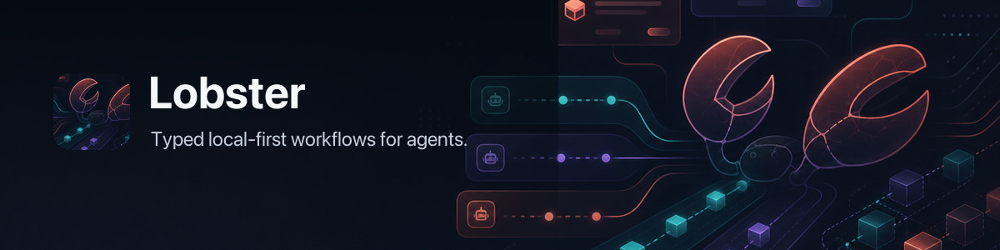

# 🦞 Lobster



An OpenClaw-native workflow shell: typed (JSON-first) pipelines, jobs, and approval gates.


## Example of Lobster at work
OpenClaw (or any other AI agent) can use `lobster` as a workflow engine and avoid re-planning every step — saving tokens while improving determinism and resumability.

### Watching a PR that hasn't had changes
```
node bin/lobster.js "workflows.run --name github.pr.monitor --args-json '{\"repo\":\"openclaw/openclaw\",\"pr\":1152}'"
[
  {
    "kind": "github.pr.monitor",
    "repo": "openclaw/openclaw",
    "prNumber": 1152,
    "key": "github.pr:openclaw/openclaw#1152",
    "changed": false,
    "summary": {
      "changedFields": [],
      "changes": {}
    },
    "prSnapshot": {
      "author": {
        "id": "MDQ6VXNlcjE0MzY4NTM=",
        "is_bot": false,
        "login": "vignesh07",
        "name": "Vignesh"
      },
      "baseRefName": "main",
      "headRefName": "feat/lobster-plugin",
      "isDraft": false,
      "mergeable": "MERGEABLE",
      "number": 1152,
      "reviewDecision": "",
      "state": "OPEN",
      "title": "feat: Add optional lobster plugin tool (typed workflows, approvals/resume)",
      "updatedAt": "2026-01-18T20:16:56Z",
      "url": "https://github.com/openclaw/openclaw/pull/1152"
    }
  }
]
```
### And a PR that has a state change (in this case an approved PR)

```
 node bin/lobster.js "workflows.run --name github.pr.monitor --args-json '{\"repo\":\"openclaw/openclaw\",\"pr\":1200}'"
[
  {
    "kind": "github.pr.monitor",
    "repo": "openclaw/openclaw",
    "prNumber": 1200,
    "key": "github.pr:openclaw/openclaw#1200",
    "changed": true,
    "summary": {
      "changedFields": [
        "number",
        "title",
        "url",
        "state",
        "isDraft",
        "mergeable",
        "reviewDecision",
        "updatedAt",
        "baseRefName",
        "headRefName"
      ],
      "changes": {
        "number": {
          "from": null,
          "to": 1200
        },
        "title": {
          "from": null,
          "to": "feat(tui): add syntax highlighting for code blocks"
        },
        "url": {
          "from": null,
          "to": "https://github.com/openclaw/openclaw/pull/1200"
        },
        "state": {
          "from": null,
          "to": "MERGED"
        },
        "isDraft": {
          "from": null,
          "to": false
        },
        "mergeable": {
          "from": null,
          "to": "UNKNOWN"
        },
        "reviewDecision": {
          "from": null,
          "to": ""
        },
        "updatedAt": {
          "from": null,
          "to": "2026-01-19T05:06:09Z"
        },
        "baseRefName": {
          "from": null,
          "to": "main"
        },
        "headRefName": {
          "from": null,
          "to": "feat/tui-syntax-highlighting"
        }
      }
    },
    "prSnapshot": {
      "author": {
        "id": "MDQ6VXNlcjE0MzY4NTM=",
        "is_bot": false,
        "login": "vignesh07",
        "name": "Vignesh"
      },
      "baseRefName": "main",
      "headRefName": "feat/tui-syntax-highlighting",
      "isDraft": false,
      "mergeable": "UNKNOWN",
      "number": 1200,
      "reviewDecision": "",
      "state": "MERGED",
      "title": "feat(tui): add syntax highlighting for code blocks",
      "updatedAt": "2026-01-19T05:06:09Z",
      "url": "https://github.com/openclaw/openclaw/pull/1200"
    }
  }
]
```

## Goals


- Typed pipelines (objects/arrays), not text pipes.
- Local-first execution.
- No new auth surface: Lobster must not own OAuth/tokens.
- Composable macros that OpenClaw (or any agent) can invoke in one step to save tokens.

## Quick start

From this folder:

- `pnpm install`
- `pnpm test`
- `pnpm lint`
- `node ./bin/lobster.js --help`
- `node ./bin/lobster.js doctor`
- `node ./bin/lobster.js "exec --json --shell 'echo [1,2,3]' | where '0>=0' | json"`

### Notes

- `pnpm test` runs `tsc` and then executes tests against `dist/`.
- `bin/lobster.js` prefers the compiled entrypoint in `dist/` when present.
## Commands

- `exec`: run OS commands
- `exec --stdin raw|json|jsonl`: feed pipeline input into subprocess stdin
- `where`, `pick`, `head`: data shaping
- `json`, `table`: renderers
- `approve`: approval gate (TTY prompt or `--emit` for OpenClaw integration)

## Next steps

- OpenClaw integration: ship as an optional OpenClaw plugin tool.

## Workflow files

Lobster workflow files are meant to read like small scripts:

- `run:` or `command:` for deterministic shell/CLI steps
- `pipeline:` for native Lobster stages like `llm.invoke`
- `approval:` for hard workflow gates between steps
- `stdin: $step.stdout` or `stdin: $step.json` to pass data forward

```
lobster run path/to/workflow.lobster
lobster run --file path/to/workflow.lobster --args-json '{"tag":"family"}'
```

Example file:

```yaml
name: jacket-advice
args:
  location:
    default: Phoenix
steps:
  - id: fetch
    run: weather --json ${location}

  - id: confirm
    approval: Want jacket advice from the LLM?
    stdin: $fetch.json

  - id: advice
    pipeline: >
      llm.invoke --prompt "Given this weather data, should I wear a jacket?
      Be concise and return JSON."
    stdin: $fetch.json
    when: $confirm.approved
```

Notes:

- `run:` and `command:` are equivalent; `run:` is the preferred spelling for new files.
- `pipeline:` shares the same args/env/results model as shell steps, so later steps can still reference `$step.stdout` or `$step.json`.
- If you need a human checkpoint before an LLM call, use a dedicated `approval:` step in the workflow file rather than `approve` inside the nested pipeline.
- `cwd`, `env`, `stdin`, `when`, and `condition` work for both shell and pipeline steps.
- Use `retry`, `timeout_ms`, and `on_error` per step to control transient-failure behavior and recovery.
- Approval steps can optionally enforce identity constraints:
  - `approval.required_approver` (or `requiredApprover`) requires an exact approver id.
  - `approval.require_different_approver` (or `requireDifferentApprover`) requires approver id to differ from initiator.
  - `approval.initiated_by` (or `initiatedBy`) sets the initiator id for comparison.
  - `LOBSTER_APPROVAL_INITIATED_BY` can provide a default initiator id at run time.
  - `LOBSTER_APPROVAL_APPROVED_BY` is used at resume/approval time for identity checks.

### Command-level input requests

Pipeline commands can call `ctx.requestInput({ prompt, responseSchema, defaults, subject, suspendedState })` to pause in tool mode, workflows, or the SDK and resume the same command after a structured response. CLI/tool resume tokens store only a state key; the persisted state validates the suspended request metadata before returning the submitted response to the command. SDK same-command resumes store the command frame in the configured SDK state directory.

Commands are re-run on resume, so they must be idempotent until `requestInput` returns. Array-backed command input is snapshotted with bounds for replay; lazy stream input is not buffered and requires a compact JSON `suspendedState` supplied by the command. On resume, call `ctx.requestInput.getSuspendedState()` before reading lazy input to restore that command-owned continuation state.

## Visualizing workflows

Use `lobster graph` to inspect workflow structure before execution.

```bash
lobster graph --file path/to/workflow.lobster
lobster graph --file path/to/workflow.lobster --format mermaid
lobster graph --file path/to/workflow.lobster --format dot
lobster graph --file path/to/workflow.lobster --format ascii
lobster graph --file path/to/workflow.lobster --args-json '{"location":"Seattle"}'
```

What gets visualized:

- each workflow step as a node (`run`, `pipeline`, `approval`, etc.)
- data-flow edges from `stdin: $step.stdout` / `$step.json` references
- conditional dependencies from `when:` / `condition:` expressions
- approval gates as diamond-shaped nodes in `mermaid` and `dot` output

Format notes:

- `mermaid` (default): emits `flowchart TD` text for GitHub/Markdown rendering
- `dot`: emits Graphviz DOT syntax
- `ascii`: emits a terminal-friendly node/edge list

## Calling LLMs from workflows

Use `llm.invoke` from a native `pipeline:` step for model-backed work:

```bash
llm.invoke --prompt 'Summarize this diff'
llm.invoke --provider openclaw --prompt 'Summarize this diff'
llm.invoke --provider pi --prompt 'Summarize this diff'
```

Provider resolution order:

- `--provider`
- `LOBSTER_LLM_PROVIDER`
- auto-detect from environment

Built-in providers today:

- `openclaw` via `OPENCLAW_URL` / `OPENCLAW_TOKEN`
- `pi` via `LOBSTER_PI_LLM_ADAPTER_URL` (typically supplied by the Pi extension)
- `http` via `LOBSTER_LLM_ADAPTER_URL`

Workflow `_meta.cost` and `cost_limit` use a static pricing table plus optional overrides from `LOBSTER_LLM_PRICING_JSON`, for example `{"my-model":{"input":1.0,"output":2.0}}` in USD per million tokens. Unknown or missing model IDs still record token counts with zero estimated cost, but Lobster warns on stderr so stale or missing pricing does not fail silently.

`llm_task.invoke` remains available as a backward-compatible alias for the OpenClaw provider.

### Calling configured OpenClaw agents

Use `openclaw.agent` when a workflow needs a configured OpenClaw agent rather than a direct model call:

```bash
openclaw.agent --agent ops --prompt 'Summarize these logs'
openclaw.agent --agent ops --session-key incident-42 --model openai/gpt-5.4 --prompt 'Continue the investigation'
```

The command delegates agent identity, model defaults and overrides, sessions, authentication, and execution to the installed `openclaw agent` CLI. It accepts `--agent`, `--session-key`, `--session-id`, `--model`, `--thinking`, `--timeout`, and `--local`, and returns OpenClaw's structured `--json` response. Pipeline input is appended to the prompt as labeled JSONL.

### `pipeline:` vs `run:` for LLM calls

- Use `pipeline:` for `openclaw.agent`, `llm.invoke`, and `llm_task.invoke` (they are Lobster pipeline stages, not shell executables).
- Use `run:` only for real binaries in your shell (for example `openclaw.invoke`).

Example (`stdin` from a prior step is passed to the LLM as artifacts):

```yaml
steps:
  - id: make_words
    run: echo "One two three four five six"

  - id: count_words
    pipeline: llm_task.invoke --prompt "How many words have been pasted below?"
    stdin: $make_words.stdout
```

## Calling OpenClaw tools from workflows

Shell `run:` steps execute in your system shell, so OpenClaw tool calls there must be real executables.

If you install Lobster via npm/pnpm, it installs a small shim executable named:

- `openclaw.invoke` (preferred)
- `clawd.invoke` (alias)

These shims forward to the Lobster pipeline command of the same name.

### Example: invoke llm-task

Prereqs:

- `OPENCLAW_URL` points at a running OpenClaw gateway
- optionally `OPENCLAW_TOKEN` if auth is enabled

```bash
export OPENCLAW_URL=http://127.0.0.1:18789
# export OPENCLAW_TOKEN=...
```

In a workflow:

```yaml
name: hello-world
steps:
  - id: greeting
    run: >
      openclaw.invoke --tool llm-task --action json --args-json '{"prompt":"Hello"}'
```

### Passing data between steps (no temp files)

Use `stdin: $stepId.stdout` to pipe output from one step into the next.

## Args and shell-safety

`${arg}` substitution is a raw string replace into the shell command text.

For anything that may contain quotes, `$`, backticks, or newlines, prefer env vars:

- every resolved workflow arg is exposed as `LOBSTER_ARG_<NAME>` (uppercased, non-alnum → `_`)
- the full args object is also available as `LOBSTER_ARGS_JSON`

Example:

```yaml
args:
  text:
    default: ""
steps:
  - id: safe
    env:
      TEXT: "$LOBSTER_ARG_TEXT"
    command: |
      jq -n --arg text "$TEXT" '{"result": $text}'
```
